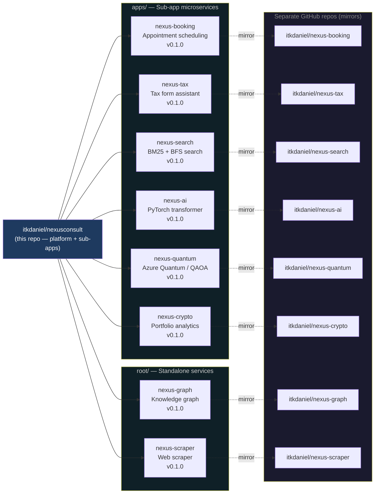
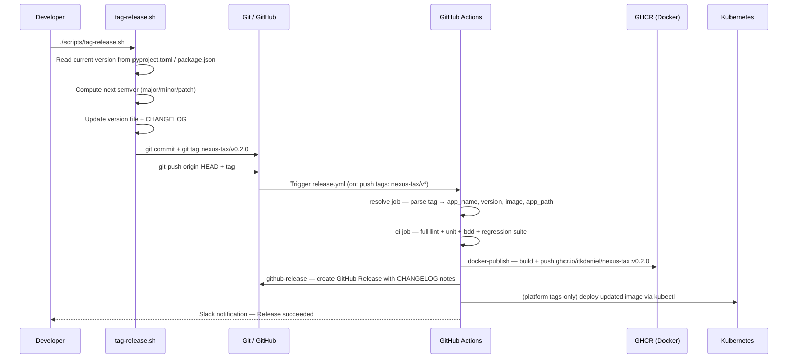

# NexusConsult Platform

> Full-stack automation consulting platform with AI-powered search, quantum optimisation, and real-time analytics.

[](https://github.com/itkdaniel/nexusconsult/actions/workflows/ci.yml)
[](https://github.com/itkdaniel/nexusconsult/actions/workflows/release.yml)


---

## Repository Map



---

## Release Flow



---

## Versioning Strategy

| Repo / Service | Current Version | Tag Format | Docker Image |
|----------------|----------------|------------|--------------|
| Platform (main app) | `v1.5.0` | `v{semver}` | `ghcr.io/itkdaniel/web:{tag}` |
| nexus-booking | `v0.1.0` | `nexus-booking/v{semver}` | `ghcr.io/itkdaniel/nexus-booking:{tag}` |
| nexus-tax | `v0.1.0` | `nexus-tax/v{semver}` | `ghcr.io/itkdaniel/nexus-tax:{tag}` |
| nexus-search | `v0.1.0` | `nexus-search/v{semver}` | `ghcr.io/itkdaniel/nexus-search:{tag}` |
| nexus-ai | `v0.1.0` | `nexus-ai/v{semver}` | `ghcr.io/itkdaniel/nexus-ai:{tag}` |
| nexus-graph | `v0.1.0` | `nexus-graph/v{semver}` | `ghcr.io/itkdaniel/nexus-graph:{tag}` |
| nexus-scraper | `v0.1.0` | `nexus-scraper/v{semver}` | `ghcr.io/itkdaniel/nexus-scraper:{tag}` |
| nexus-quantum | `v0.1.0` | `nexus-quantum/v{semver}` | `ghcr.io/itkdaniel/nexus-quantum:{tag}` |
| nexus-crypto | `v0.1.0` | `nexus-crypto/v{semver}` | `ghcr.io/itkdaniel/nexus-crypto:{tag}` |

All versions follow [Semantic Versioning 2.0.0](https://semver.org/).

---

## Architecture

### Stack

| Layer | Technology |
|-------|-----------|
| Frontend | React 19, TypeScript, Tailwind CSS v4, Wouter, TanStack Query, Framer Motion |
| Backend | Express.js (TypeScript), HMAC-SHA256 JWT auth, WebSocket pub/sub |
| Database | PostgreSQL via Drizzle ORM |
| Search | Python FastAPI (BM25, Levenshtein, BFS graph, Jaccard) |
| AI/ML | PyTorch transformer built from scratch (NexusTransformer) |
| Quantum | Azure Quantum circuits + QAOA/VQE variational solvers |
| Infra | Docker, Kubernetes (K8s), GitHub Actions CI/CD, GHCR |

### Services

| Port | Service | Description |
|------|---------|-------------|
| 5000 | Web App | TypeScript/Express — SPA + REST API + WebSocket |
| 8000 | nexus-search | BM25 search, tag graph, Redis cache |
| 8001 | nexus-ai | PyTorch transformer endpoints |
| 8002 | nexus-graph | Neo4j knowledge graph + React explorer |
| 8003 | nexus-tax | Federal + state tax form assistant |
| 8004 | nexus-booking | Async appointment booking |
| 8005 | nexus-quantum | Azure Quantum / QAOA optimisation |
| 8006 | nexus-crypto | Crypto portfolio analytics |
| 8007 | nexus-scraper | Web scraper job queue |

---

## Quick Start

```bash
# Install dependencies
npm install

# Start dev server (port 5000)
npm run dev

# Sync database schema
npm run db:push

# Seed sample data
npx tsx scripts/seed-projects.ts
npx tsx scripts/seed-roles.ts

# Run tests
npm run test:unit        # 172 vitest unit + integration tests
npm run test:e2e         # Playwright E2E
```

### Docker (full stack)

```bash
docker compose up --build
```

### Release a sub-app

```bash
chmod +x scripts/tag-release.sh
./scripts/tag-release.sh
# Follow the prompts: choose target, bump type → commits, tags, pushes automatically
```

---

## CI/CD Workflows

| Workflow | File | Trigger |
|----------|------|---------|
| Platform CI | `.github/workflows/ci.yml` | push/PR to main, develop, feature/* |
| Platform CD | `.github/workflows/deploy.yml` | push to main |
| Release | `.github/workflows/release.yml` | push of any `v*` or `{app}/v*` tag |
| nexus-booking CI | `.github/workflows/nexus-booking-ci.yml` | changes to `apps/nexus-booking/**` |
| nexus-tax CI | `.github/workflows/nexus-tax-ci.yml` | changes to `apps/nexus-tax/**` |
| nexus-search CI | `.github/workflows/nexus-search-ci.yml` | changes to `apps/nexus-search/**` |
| nexus-ai CI | `.github/workflows/nexus-ai-ci.yml` | changes to `apps/nexus-ai/**` |
| nexus-graph CI | `.github/workflows/nexus-graph-ci.yml` | changes to `nexus-graph/**` |
| nexus-scraper CI | `.github/workflows/nexus-scraper-ci.yml` | changes to `nexus-scraper/**` |
| nexus-quantum CI | `.github/workflows/nexus-quantum-ci.yml` | changes to `apps/nexus-quantum/**` |
| nexus-crypto CI | `.github/workflows/nexus-crypto-ci.yml` | changes to `apps/crypto-analytics/**` |

---

## Default Credentials

Default login credentials for local development are documented in `.env.example`.
Do **not** use these credentials in any internet-accessible environment.

---

## Documentation

- [`CONTRIBUTING.md`](CONTRIBUTING.md) — branch strategy, PR process, versioning
- [NexusGraph documentation source](nexus-graph/docs/source/index.rst) — setup, architecture, API limits, clustering, and troubleshooting; the Pages URL is linked here after a verified deployment
- [`CHANGELOG.md`](CHANGELOG.md) — platform release history
- [`apps/nexus-booking/CHANGELOG.md`](apps/nexus-booking/CHANGELOG.md)
- [`apps/nexus-tax/CHANGELOG.md`](apps/nexus-tax/CHANGELOG.md)
- [`apps/nexus-search/CHANGELOG.md`](apps/nexus-search/CHANGELOG.md)
- [`apps/nexus-ai/CHANGELOG.md`](apps/nexus-ai/CHANGELOG.md)
- [`apps/nexus-quantum/CHANGELOG.md`](apps/nexus-quantum/CHANGELOG.md)
- [`apps/crypto-analytics/CHANGELOG.md`](apps/crypto-analytics/CHANGELOG.md)

---

## License

MIT © [itkdaniel](https://github.com/itkdaniel)
