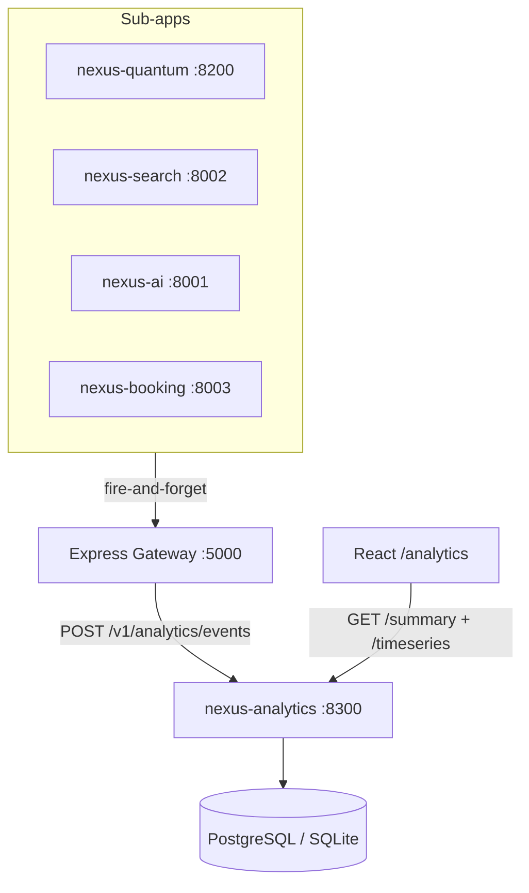

# nexus-analytics

> **Platform API Analytics Microservice** — records and aggregates API call events
> from all NexusConsult sub-apps.

| Field   | Value        |
|---------|-------------|
| Port    | **8300**    |
| Version | **0.1.0**   |
| Docs    | `/docs`      |
| Health  | `/health`    |

## Quick Start

```bash
cd apps/nexus-analytics
pip install -r requirements-dev.txt
uvicorn app.main:create_app --factory --port 8300 --reload
```

## Endpoints

| Method | Path                              | Description                        |
|--------|-----------------------------------|------------------------------------|
| POST   | `/v1/analytics/events`            | Record one API call event          |
| GET    | `/v1/analytics/summary`           | Per-service aggregate stats        |
| GET    | `/v1/analytics/top-endpoints`     | Top N endpoints by call volume     |
| GET    | `/v1/analytics/errors`            | Error-rate breakdown per service   |
| GET    | `/v1/analytics/timeseries`        | Time-bucketed call/error counts    |
| GET    | `/health`                         | Liveness probe                     |
| GET    | `/info`                           | Service metadata                   |

## Logging

Console output is **color-coded by level**:

| Level    | Colour         |
|----------|---------------|
| DEBUG    | Cyan          |
| INFO     | Bright Green  |
| WARNING  | Bright Yellow |
| ERROR    | Bright Red    |
| CRITICAL | Bright Magenta|

JSON logs are written to `logs/nexus-analytics.jsonl` (10 MB rotation, 5 backups).

## Event Schema

```json
{
  "service":     "nexus-quantum",
  "method":      "POST",
  "endpoint":    "/v1/quantum/jobs",
  "status_code": 201,
  "latency_ms":  42.3,
  "error":       null,
  "ts":          1751234567.89
}
```

## Testing

```bash
pytest tests/ -v --tb=short
```

## Architecture


