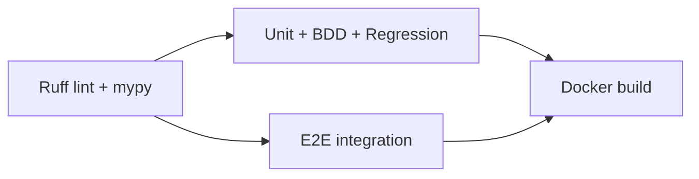

# nexus-quantum — CI/CD Pipeline

## Overview

The CI pipeline is triggered by any push or pull request that touches files
under `apps/nexus-quantum/**`. It runs four jobs in sequence: lint → unit+bdd+regression → e2e → docker build.

## Pipeline Stages



### 1. Lint (ruff + mypy)

- **Ruff** enforces PEP 8, import ordering, and common anti-patterns across
  `app/` and `tests/`
- **mypy** performs static type checking with `--ignore-missing-imports`
- Runs in parallel with no DB dependency

### 2. Unit + BDD + Regression

- **Unit tests** (`tests/unit/`) — pytest + httpx ASGI transport, SQLite in-memory
- **BDD tests** (`tests/bdd/`) — pytest-bdd feature files + step definitions
- **Regression tests** (`tests/regression/`) — contract tests pinning response shapes
- Coverage threshold: **≥ 85%**
- No external services required (SQLite + toy quantum simulator)

### 3. E2E Integration

- Full request/response cycle against the live FastAPI app
- SQLite in-memory DB — no PostgreSQL needed in CI
- Azure Quantum is absent → graceful local simulation mode
- Runs in parallel with the unit stage

### 4. Docker Build

- Multi-stage build: `builder` (gcc + pip install) → `runtime` (slim)
- Runs `docker build -t nexus-quantum:ci .` to verify the image builds
- Triggered only after both test stages pass

## Local CI Simulation

```bash
cd apps/nexus-quantum

# Lint
pip install ruff mypy
ruff check app/ tests/
mypy app/ --ignore-missing-imports --no-strict-optional

# Tests with coverage
pip install -r requirements-dev.txt
pytest tests/ --cov=app --cov-report=term-missing --cov-fail-under=85

# Docker build
docker build -t nexus-quantum:ci .
```

## Environment Variables in CI

| Variable | Value | Purpose |
|---|---|---|
| `AZURE_QUANTUM_WORKSPACE_ID` | *(absent)* | Service runs in local simulation mode |
| `DATABASE_URL` | SQLite in-memory | No PostgreSQL required |

## Deployment

For production deployment, add `nexus-quantum` to the root `docker-compose.yml`
(already included) and set the Azure Quantum environment variables in your
secrets store. The gateway automatically routes requests from `/api/apps/quantum`
once `NEXUS_QUANTUM_URL` is set.

## Coverage Report

Coverage is collected via `pytest-cov` and reported to stdout. The CI enforces
`--cov-fail-under=85` to maintain code quality. Future improvements:

- Upload coverage to Codecov / Coveralls
- Add mutation testing with `mutmut`
- Parallelise test collection with `pytest-xdist`
