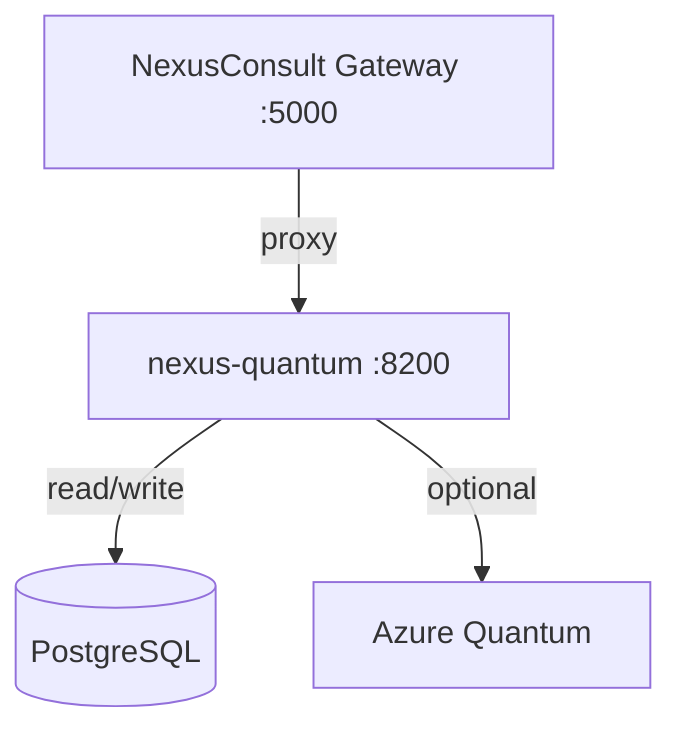
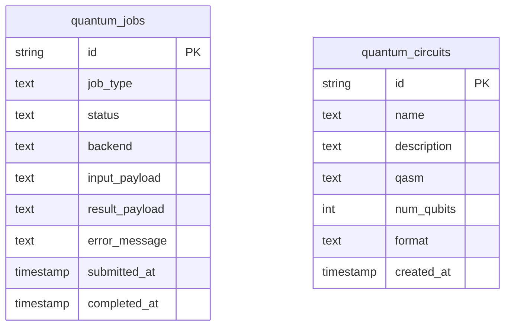
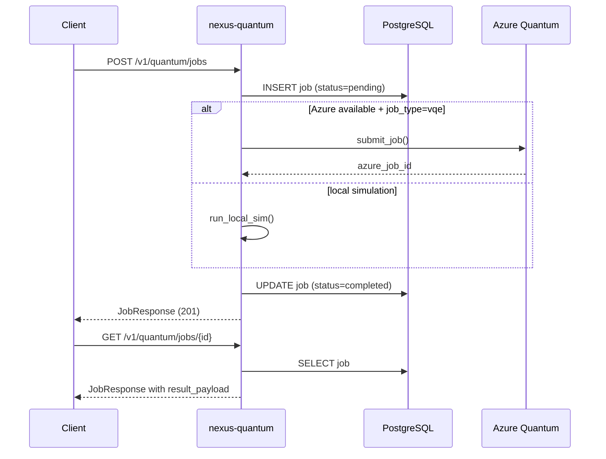

# nexus-quantum

Azure Quantum microservice for NexusConsult. Exposes quantum circuit simulation,
QAOA/VQE variational algorithms, and quantum-inspired optimization through a clean
REST API. Runs locally without Azure credentials by degrading to built-in simulators.

## Architecture



### Database ER Diagram



### Job Submission Flow



## Azure Quantum Setup

1. Create an Azure Quantum workspace:
   ```bash
   az quantum workspace create \
     --resource-group my-rg \
     --workspace-name my-quantum \
     --location eastus \
     --provider-sku-list IonQ/Pay-As-You-Go
   ```

2. Set environment variables:
   ```bash
   export AZURE_QUANTUM_WORKSPACE_ID=<workspace-id>
   export AZURE_QUANTUM_SUBSCRIPTION_ID=<subscription-id>
   export AZURE_QUANTUM_RESOURCE_GROUP=my-rg
   export AZURE_QUANTUM_WORKSPACE_NAME=my-quantum
   export AZURE_QUANTUM_LOCATION=eastus
   ```

3. Install optional Azure SDK (not required for local simulation):
   ```bash
   pip install azure-quantum
   ```

When `AZURE_QUANTUM_WORKSPACE_ID` is absent, the service runs entirely
in local simulation mode — all endpoints work without any Azure account.

## Local Development

```bash
# Install dependencies
pip install -r requirements-dev.txt

# Run dev server
uvicorn app.main:app --host 0.0.0.0 --port 8200 --reload

# Run with Docker Compose (includes PostgreSQL)
docker-compose up -d

# Run Alembic migrations (PostgreSQL)
alembic upgrade head
```

## Running Tests

```bash
# All tests
pytest tests/ -v

# Unit tests only
pytest tests/unit/ -v

# BDD tests
pytest tests/bdd/ -v -m bdd

# Regression contract tests
pytest tests/regression/ -v -m regression

# E2E integration tests
pytest tests/e2e/ -v -m e2e

# With coverage
pytest tests/ --cov=app --cov-report=term-missing
```

## Endpoint Reference

| Method | Path | Auth | Description |
|--------|------|------|-------------|
| GET | `/health` | No | Liveness probe |
| GET | `/info` | No | Service metadata |
| GET | `/docs` | No | Swagger UI |
| GET | `/openapi.json` | No | OpenAPI spec |
| POST | `/v1/quantum/jobs` | No | Submit quantum job |
| GET | `/v1/quantum/jobs` | No | List jobs |
| GET | `/v1/quantum/jobs/{id}` | No | Poll job status |
| DELETE | `/v1/quantum/jobs/{id}` | No | Cancel job |
| POST | `/v1/quantum/simulate` | No | Simulate circuit |
| GET | `/v1/quantum/simulate/backends` | No | List simulators |
| POST | `/v1/quantum/optimize/portfolio` | No | Portfolio optimization (QAOA) |
| POST | `/v1/quantum/optimize/route` | No | Route optimization |
| POST | `/v1/quantum/optimize/constraint` | No | QUBO constraint solver |
| GET | `/v1/quantum/optimize/algorithms` | No | List algorithms |
| POST | `/v1/quantum/circuits` | No | Save circuit definition |
| GET | `/v1/quantum/circuits` | No | List circuits |
| GET | `/v1/quantum/circuits/{id}` | No | Get circuit |

### Job Types

| `job_type` | Description | Azure Required |
|---|---|---|
| `circuit_simulation` | Simulate a quantum circuit (Qiskit/toy) | No |
| `portfolio_optimization` | Markowitz + QAOA weights | No |
| `route_optimization` | TSP/VRP quantum annealing | No |
| `constraint_qubo` | QUBO simulated annealing | No |
| `vqe` | Variational Quantum Eigensolver | Yes (falls back in local mode) |

## Environment Variables

| Variable | Default | Description |
|---|---|---|
| `DATABASE_URL` | `postgresql+asyncpg://...` | PostgreSQL connection |
| `PORT` | `8200` | Service port |
| `DEBUG` | `false` | Enable SQLAlchemy echo |
| `AZURE_QUANTUM_WORKSPACE_ID` | `` | Azure workspace ID (optional) |
| `AZURE_QUANTUM_SUBSCRIPTION_ID` | `` | Azure subscription |
| `AZURE_QUANTUM_RESOURCE_GROUP` | `` | Azure resource group |
| `AZURE_QUANTUM_WORKSPACE_NAME` | `` | Azure workspace name |
| `AZURE_QUANTUM_LOCATION` | `eastus` | Azure region |
| `CORS_ORIGINS` | `["*"]` | Allowed CORS origins |
